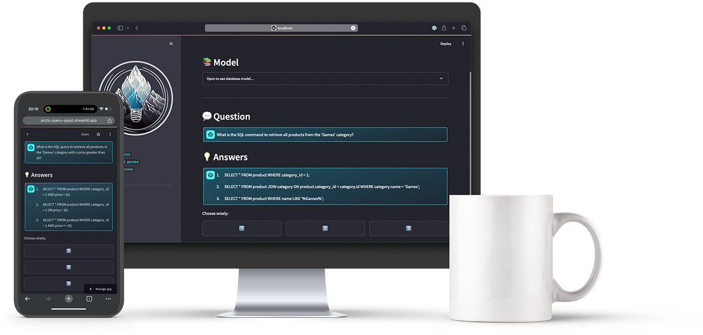
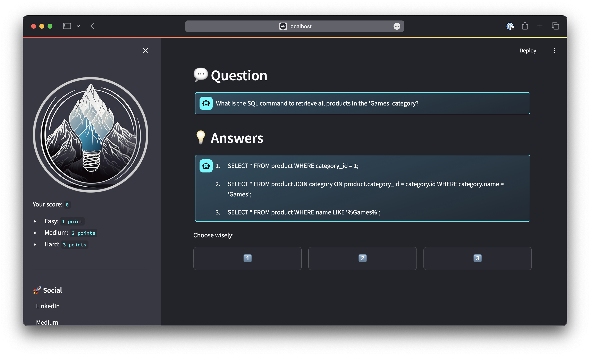
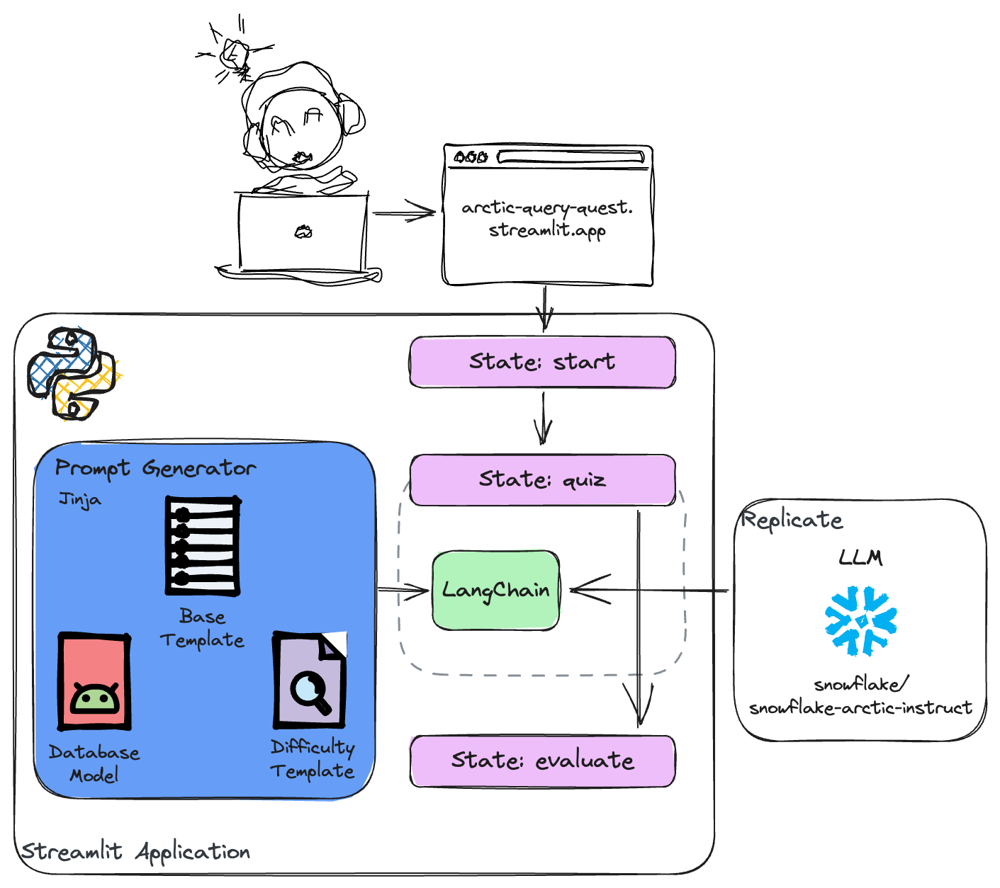
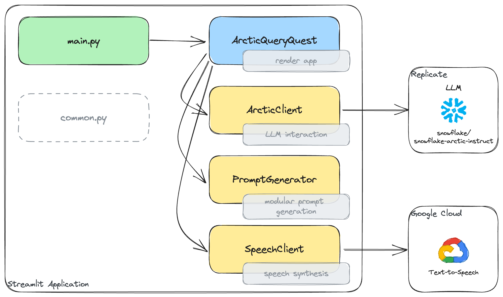
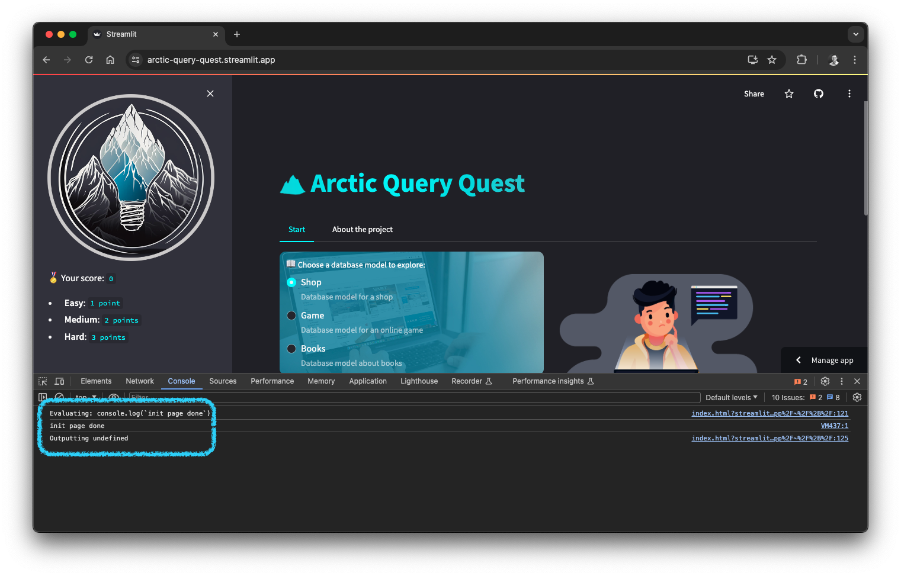
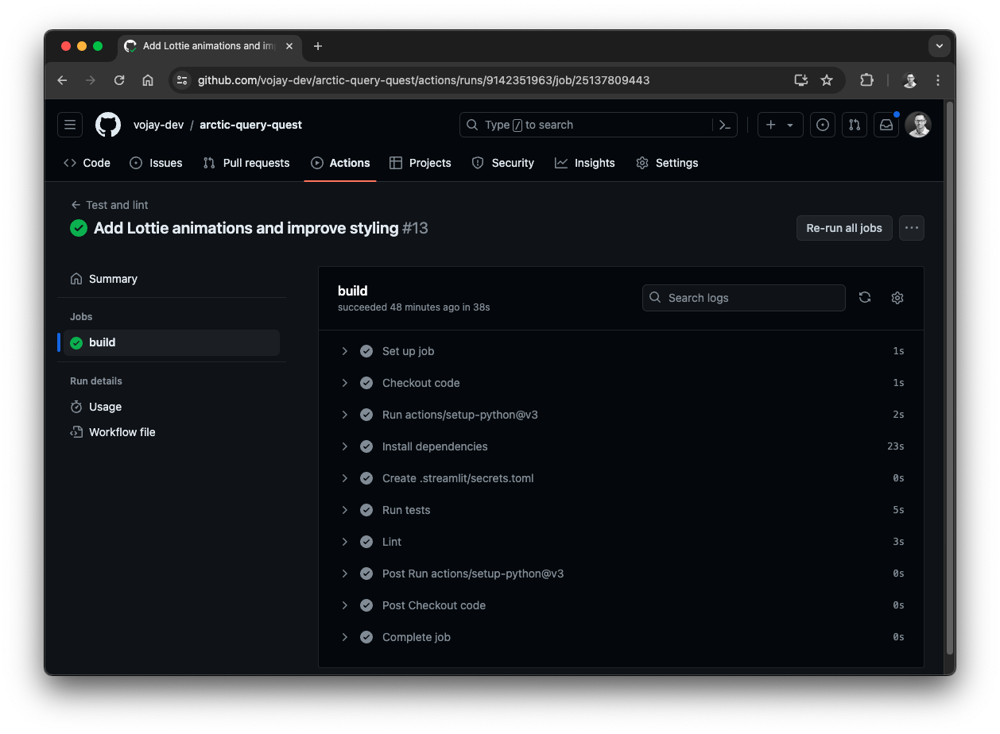

# Arctic Query Quest

**This project was created as part of the [THE FUTURE OF AI IS OPEN Hackathon 2024](https://arctic-streamlit-hackathon.devpost.com/)**.


Learn SQL and get familiar with data models in a fun and interactive way! 🏔️ Arctic Query Quest makes learning SQL and getting familiar with data models engaging to revolutionize SQL education in companies, schools and universities.

Try it yourself: [arctic-query-quest.streamlit.app](https://arctic-query-quest.streamlit.app/)



## 💡 Inspiration

Growing up as a passionate gamer and now working as a Data Engineer, I've always been drawn to the intersection of gaming and data. With this project, I combined two of my greatest passions: gaming and data. Back in the 90' I always enjoyed the video game series You Don't Know Jack, a delightful blend of trivia and comedy that not only entertained but also taught me a thing or two. Generally, the usage of games for educational purposes is another concept that fascinates me.

In 2023, I organized a workshop to teach kids and young adults game development. They learned about mathematical concepts behind collision detection, yet they had fun as everything was framed in the context of gaming. It was eye-opening that gaming is not only a huge market but also holds a great potential for knowledge sharing.

Generating SQL queries based on natural language and a given data model is a typical use-case for LLMs especially like the Snowflake Arctic Instruct model. But what about adding a twist? What if we use it to generate quiz questions based on a data model, so that the user can learn SQL and get familiar with the data model in a fun and engaging way? The answer is 🏔️ **Arctic Query Quest**!

Getting answers from LLMs right away is great, but knowledge sharing and learning falls short often in a business context. Arctic Query Quest is a proof of concept to revolutionize SQL education in companies, schools and universities. It is about enabling users rather than simply providing answers.

By feeding the Arctic Instruct LLM with the DDL statements of the model itself together with sample data and the modular prompt generation approach, that allows to adjust the experience e.g. by changing the difficulty, allows for many business use-cases, be it onboarding new employees, teaching SQL in schools or universities or simply having fun with the application.

## 🎮 What it does

Arctic Query Quest is a fun and interactive way to learn SQL and get familiar with data models. The user can choose a data model and a difficulty. Then, a prompt is generated out of several moduls based on the user configuration.

The Snowflake Arctic Instruct model is used to create a quiz using the generated prompt.

The user is then presented with the quiz question and three possible answers, all part of the model response. The user can make a guess, the app will evaluate the answer and provide an explanation of the correct answer.

Via speech synthesis, the app reads the question out loud to the user. This is especially useful for users with visual impairments or for users who prefer to listen to the question instead of reading it.



## ⚙️ How I built it

**Tech Stack 🚀**

- Python 3.11
- [Streamlit](https://streamlit.io/) for developing and deploying the web app
- [Pydantic](https://docs.pydantic.dev/latest/) for data modeling and validation
- [Jinja](https://jinja.palletsprojects.com/) templating for modular prompt generation
- [LangChain](https://www.langchain.com/) for LLM interaction and prompt generation
- [Poetry](https://python-poetry.org/) for dependency management
- [Replicate](https://replicate.com/) for running predictions with the Snowflake Arctic model
- [Snowflake Arctic Instruct](https://www.snowflake.com/en/data-cloud/arctic/) as the base LLM for any predictions
- [pytest](https://docs.pytest.org/en/8.2.x/) for test implementation and execution
- [Ruff](https://docs.astral.sh/ruff/) as linter and code formatter
- [Github Actions](https://github.com/features/actions) to automatically run tests and linter on every push



### Streamlit web app

The Streamlit application was implemented with focus on making it production ready with clean code, high impact and visual appeal. The app is structured in a way that it is easy to extend and maintain. Therefore, it uses `arctic_query_quest/main.py` as a rather minimal entry point and all other logic is separated in different classes.

The main file simply calls the render function depending on the current state of the application. The rest of the business logic splits into the following classes:

- `ArcticQueryQuest`: Main class which renders the different states and brings all parts together.
- `ArcticClient`: Handles the interaction with the Snowflake Arctic Instruct model via Replicate.
- `PromptGenerator`: Generates the prompt in a modular way based on the user configuration.
- `SpeechClient`: Handles the speech synthesis via the Google Cloud speech API.



#### Project build and dependency management

The project uses [Poetry](https://python-poetry.org/) for dependency management. The three main tasks Poetry can help you with are: Build, Publish and Track. The idea is to have a deterministic way to manage dependencies, to share your project and to track dependency states.

Poetry also handles the creation of virtual environments for you. Per default, those are in a centralized folder within your system. However, if you prefer to have the virtual environment of project in the project folder, like I do, it is a simple config change:

```sh
poetry config virtualenvs.in-project true
```

With `poetry new` you can then create a new Python project. It will create a virtual environment linking you systems default Python. If you combine this with [pyenv](https://github.com/pyenv/pyenv){:target="_blank"}, you get a flexible way to create projects using specific versions. Alternatively, you can also tell Poetry directly which Python version to use: `poetry env use /full/path/to/python`.

Once you have a new project, you can use `poetry add` to add dependencies to it. Also, with `poetry run` you can execute commands within the virtual environment of the project without manually activating it.

With this, Arctic Query Quest is using Poetry to manage its dependencies and to ensure a clean and reproducible development environment. Simply run `poetry install` to install all dependencies.

Also, the project itself, tests and the linter can easily be executed with Poetry:

- Run project: `poetry run streamlit run arctic_query_quest/main.py`
- Run tests: `poetry run python -m pytest tests/ -v`
- Run linter: `poetry run ruff check --fix`

To make it even more convenient, the project provides a `Makefile` with shortcuts for these tasks.

#### State management

The Streamlit web app is the main interface for the user. To increase the look and feel of the app, it is not using multiple pages but a single page with different states. This allows for more complex flows.

The current state is stored in the session state as `st.session_state.app_state`. The app has the following states:

- `start`: The initial state of the app. The user can configure the session, choose a data model and difficulty and start the quiz.
- `quiz`: At this state, the app is interacting with the Arctic model to generate a quiz, including the answers and an explanation of the correct answer. The user is presented with the quiz and can make a guess.
- `evaluate`: Here, the users answer is evaluated and the result is shown.

The state is represented as an `enum` for more type safety:

```py
class AppState(Enum):
    START = "start"
    QUIZ = "quiz"
    EVALUATE = "evaluate"
```

To handle the rendering of the app, all elements are added to an `st.empty()` element called `placeholder`. This allows to remove elements at any point, or replace several elements at once. In this case it is used to replace all content when the state changes. That way, the app is implementing a more complex user flow while handling everything with a single page approach.

With the following function in the `ArcticQueryQuest` class, the state is changed easily and also takes care of removing the current content:

```py
    def set_state(self, state: AppState):
        logger.info(f"switching state to {state}")
        self.placeholder.empty()
        st.session_state.app_state = state
```

It also shows that the app is using logging to improve tracking the state flow.

To render the content, each state has its own function. Then main function then simply calls the function based on the current state:

```py
if __name__ == '__main__':
    init_page()
    console_log("init page done")
    arctic_query_quest: ArcticQueryQuest = ArcticQueryQuest()

    state = st.session_state.app_state

    console_log(f"rendering state: {state}")
    if state == AppState.START:
        arctic_query_quest.start()
    elif state == AppState.QUIZ:
        arctic_query_quest.quiz()
    elif state == AppState.EVALUATE:
        arctic_query_quest.evaluate()
```

Another interesting aspect which can be seen here is the `console_log` helper function. This function is used to invoke a JavaScript snippet, which simply calls `console.log` for a given string. That way, relevant messages like the current state can be logged to the browser console.



#### Configuration and customization

Visual appeal was an important aspect for the implementation of the app. The goal was to make it stand out and use an overall theme that fits the Arctic theme. To handle this customization and to keep configuration related code separate from the main logic, a `common.py` file was created.

When rendering the app, the `init_page()` function is called, which covers the following aspects:

```py
def init_page():
    configure()
    init_state()
    apply_style()
    menu()
```

- `configure`: Set page configurations like the layout, which is set to `wide` in this case.
- `init_state`: Initialize the session state by ensuring all state variables are set and use a proper default, such as `app_state`.
- `apply_style`: Reads the file `style.css` and applies this CSS via `st.html("<style>...</style>")`. This keeps CSS separate from the Python code and allows for more complex styling adjustments.
- `menu`: Renders the sidebar.

By keeping the configuration and customization separate, the main logic is more focused and easier to maintain.

Additionally, there are some more special adjustments which I would like to highlight:

**Custom Theme**

The app uses a custom theme defined in the `.streamlit/config.toml` file. This sets a color scheme that fits the Arctic theme.

```toml
[theme]
base="dark"
primaryColor="#32fcff"
backgroundColor="#23232b"
secondaryBackgroundColor="#383844"
```

**CSS**

Via some advanced CSS selectors, also elements which normally can't be styled in Streamlit can be adjusted, for example:

```css
[data-testid^="chatAvatarIcon"] {
    background-color: #32fcff !important;
}
```

**Component Customization**

To improve the look and feel, some components have been customized. For example, the `st.radio()` components has been extended with a background image depending on the selected model:

```py
model_backgrounds = {
    "Shop": "https://files.janz.sh/arctic/model-shop.jpg",
    "Game": "https://files.janz.sh/arctic/model-game.jpg",
    "Books": "https://files.janz.sh/arctic/model-books.jpg"
}

if background := model_backgrounds.get(db_model, ""):
    st.html(f"<style>.stRadio {{ background: url({background}); }}</style>")
```

### LLM interaction

The interaction is decoupled and modularized with [LangChain](https://www.langchain.com/). This allows to easily switch between different models.

Furthermore, all model interaction is handled in a separate class called `ArcticClient`. By using [Pydantic](https://docs.pydantic.dev/latest/), the model response is parsed and validated to a data class:

```py
class ArcticQuiz(BaseModel):
    question: str
    answer_1: str
    answer_2: str
    answer_3: str
    correct_answer: int
    explanation: str

# ...
    
class ArcticClient:

    @retry(max_retries=8)
    def invoke(self, prompt: str) -> ArcticQuiz:
        chunks = []
        for chunk in self.llm.stream(prompt):
            chunks.append(chunk)

        output = "".join(chunks)
        return self._parse_output(output)
```

With this, the Streamlit app code is kept clean, but also it ensures that the model response is only further used when it is valid. In theory, this can be extended with more specific validation rules using [Pydantic](https://docs.pydantic.dev/latest/).

Another important aspect to make the app more robust and production ready is the usage of a custom decorator, which I implemented to automatically retry in case of unexpected LLM responses. The retry decorator wraps the invocation of the LLM and retries it up to 8 times (_configurable_) in case of an error.

```py
def retry(max_retries: int) -> callable:
    def decorator(func) -> callable:
        @wraps(func)
        def wrapper(*args, **kwargs):
            for _ in range(max_retries):
                try:
                    return func(*args, **kwargs)
                except BaseException as e:
                    logger.error(f"error in {func.__name__}: {e}")
                    if _ < max_retries - 1:
                        logger.warning(f"retrying {func.__name__}...")
                        sleep(1)
                    else:
                        raise e

        return wrapper

    return decorator
```

### Prompt generation

The prompt generation is a key aspect of the app. It is modularized and allows for easy adjustments. All logic is covered in the `PromptGenerator` class.

The Prompt Generator combines and renders Jinja template files to create a modular prompt.

Jinja is a template engine for Python. Jinja facilitates the creation of dynamic content across various domains. It separates logic from presentation, allowing for clean and maintainable codebases.

It uses the following core concepts:

* **Templates**: Text files containing content specific to the use case (e.g., HTML, configuration files, SQL queries).
* **Environment**: Manages template configuration (e.g., delimiters, autoescaping).
* **Variables**: Inserted into templates using double curly braces (`{{ variable }}`).
* **Blocks**: Defined with `` tags for control flow (e.g., loops, conditionals).
* **Comments**: Enclosed in `{# ... #}` for code readability.

Even though Jinja is often used in web development, since it enables the creation of dynamic content, it is also used for other cases like Airflow.

In this project, it is used to define templates to make the prompt generation modular. That way, our Python code is kept clean and we have a modular solution that can easily be extended.

LangChain is used to render the templates. That would allow to replace Jinja with another templating engine if needed.

For this project, there is a base template `prompt.jinja` which holds various variables which are replaced with the data model, samples and others.

Depending on the selection of the user, another template for the difficulty of the quiz (e.g. `easy.jinja`) is rendered and integrated into the base template.

### Data models

The data models are separated in the `models/` directory. Even though there are pre-defined scenarios for the current application, it is easy to extend the app with new models.

## 🛠️ Testing

The tests for the app are based on [pytest](https://docs.pytest.org/en/8.2.x/). The tests are located in the `tests/` directory.

I implemented two types of tests to illustrate the testability of the app:

- `test_arctic`: Contains tests for the `ArcticClient` class, ensuring proper handling of LLM responses.
- `test_app`: Contains integration tests where the app is actually executed using `streamlit.testing.v1.AppTest`

Using a Github Worfklow, the tests are automatically executed together with the linter to ensure a high code quality.

Also, the Streamlit secrets are stored in the Github repository secrets and are used in the Github Workflow so that the integration tests can be executed without any manual intervention.

```yml
  - name: Create .streamlit/secrets.toml
    env:
      SECRETS_CONTENT: ${{ secrets.SL_SECRETS }}
    run: |
      mkdir -p .streamlit
      echo "$SECRETS_CONTENT" > .streamlit/secrets.toml
```



## ⭐️ Accomplishments that I'm proud of

There are multiple outcomes that I am happy of:

- The product is actually fun to use. I enjoyed answering the questions generated by the model.
- The app stands out with the visual style applied.
- Parts of the project can be used for other Arctic projects, like the modular prompt generator.
- The app uses a single page approach with complex user flows, which is not common in Streamlit apps.
- The app is properly structured with classes, uses automated tests and a linter to ensure high code quality.

Last but not least, the most important aspect, this project is a proof of concept that Arctic can be used to create educational games and knowledge sharing app based on code generation with comparable low effort.

## 📚 What I've learned

- Combining up-to-date Python functionality with validation libraries like Pydantic is very powerful and can be used to ensure good data quality for LLM input.
- The Instruct version of the Snowflake Arctic model family is powerful for all code generation tasks, including SQL.
- Streamlit is a great tool to get smaller applications and prototypes up and running quickly.
- Even though it does not seem like it, Streamlit allows for much more complex visual adjustments than one might think.
- Using a session state combined with the `st.empty()` element allows for complex user flows with a single page approach.

## 🚀 What's next for Arctic Query Quest

- **Custom models**: Allow users to upload their own data models and generate quizzes based on them.
- **Multiplayer mode**: Add a multiplayer mode to compete with friends or colleagues.
- **Leaderboard**: Implement a leaderboard to track progress and compare scores.
- **Extract components**: I would like to extract several functions and components, especially in the area of customization, to make them available to the Streamlit community.

But most important: 

> I hope to encourage the development on educational games and knowledge sharing apps. I think it is crucial to not only focus on getting a specific answer from a model but to enable users to learn and understand the underlying concepts, like getting familiar with a data model.


